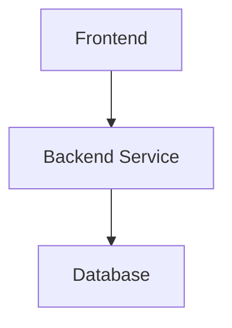

# Project/Feature Name {#project-feature-name}

**Link:** [GitHub PR / Issue](https://github.com/.../pull/...)  
**Author(s):** [AUTHOR_NAME](mailto:AUTHOR_EMAIL)  
**Status:** Draft / In Review / Approved / Completed  
**Last Updated:** [MMM dd, yyyy]

## Table of Contents

- [Summary](#summary)
- [Goals](#goals)
- [Non-Goals](#non-goals)
- [Context](#context)
- [Proposed Solution](#proposed-solution)
- [Architecture & Design](#architecture--design)
- [Data Model](#data-model)
- [API / Interface Changes](#api--interface-changes)
- [Testing & Validation](#testing--validation)
- [Alternatives Considered](#alternatives-considered)
- [Future Considerations](#future-considerations)
- [References](#references)

---

## Summary {#summary}

One-paragraph TL;DR of what this is and why it matters.

## Goals {#goals}

- Goal 1
- Goal 2
- Goal 3

## Non-Goals {#non-goals}

- What we are **explicitly not** trying to solve with this project.

## Context {#context}

Background, motivation, and relevant history. Why are we doing this now?

## Proposed Solution {#proposed-solution}

High-level overview of the chosen approach.

## Architecture & Design {#architecture--design}

- Key components and interactions
- Major technical decisions



## Data Model {#data-model}

```sql
-- Example schema changes / new tables
```

## API / Interface Changes {#api--interface-changes}

```ts
// Example: new endpoint or function signature
```

## Testing & Validation {#testing--validation}

- Unit tests
- Integration / E2E tests
- Edge cases and error handling
- Performance / security considerations
- Success metrics

## Alternatives Considered {#alternatives-considered}

### Alternative 1: [Name]

| Pros                  | Cons                  |
|-----------------------|-----------------------|
| ...                   | ...                   |

**Why rejected:** ...

### Alternative 2: [Name]

...

## Future Considerations {#future-considerations}

- Technical debt created
- Scalability / extensibility notes
- Features deferred to later phases

## References {#references}

- Related issues, RFCs, previous design docs, etc.

**Approval**

- [ ] Reviewed & Approved by: ________________
